# 19-Abgabe04-Vo-Zirkl

## TODO-List
---

- [x] Übertragen Angabe Taskliste in Markdown Readme
- [x] Einspielen Queue Vorlage aus Repository: https://github.com/michaelulm/software-configuration-management/tree/master/test-automation/Queue
- [x] Taskergebnisse Schritt für Schritt auf Git stellen
    - [x] Führung Taskliste
    - [x] Veröffentlichung in Git mit aktuell durchgeführten Tätigkeiten, z.B. Testfälle geschrieben so wird auch in der Taskliste diese Aufgabe als erledigt markiert und Testfälle inkl. geänderter Taskliste ins Repository übertragen.
- [x] Korrigieren Sie den Code bzw. Debuggen Sie ihn um die Fehler zu finden
    - [x] Es befinden sich gesamt 3 Fehler im Source Code.
    - [x] Bei Bedarf Optimieren Sie das Queue Beispiel.
    - [x] Ergänzen Sie das Beispiel nach eigenen Ermessen um es testen zu können.
- [x] Erstellen Sie für Klasse und alle Methoden Kommentare um mittels Javadoc eine API Dokumentation zu erzeugen
    - [x] Integrieren Sie ein Bild (der generierten Dokumentation) in Ihren Report.
- [x] Erstellung JUnit Tests (vollständig testen, mehrere Varianten)
    - [x] Sie werden die „selben“ Testfälle mehrfach erstellen müssen   um „mehrere
    Variationen“ für einen möglichst vollständigen Test zu erreichen. Achten Sie
    dabei mit unterschiedlichen Daten zu testen.
    - [x] JavaDoc Kommentare erstellen.
    - [x] Integrieren Sie ein Bild (der generierten Dokumentation) in Ihren Report.
- [x] Passen Sie Ihr pom.xml auf das Projekt an, damit Sie das Projekt erstellen aber auch Dokumentation generieren können.
    - [x] EntwicklerInnen Informationen hinzufügen.
    - [x] Integration Logging Bibliothek log4j mittels Maven Dependencies.
    - [x] Log4j (Version 2) integrieren und in jeder Methode ins Log schreiben
    - [x] Siehe aktualisiertes Stack Beispiel.
    - [x] Erstellen Sie einen Statischen Logger der auf die Konsole schreibt.
    - [x] Konfigurieren Sie Logger über ein properties File.
    - [x] Geben Sie eine Info Lognachricht bei Aufruf einer jeden Methode aus.
    - [x] Geben Sie eine Error Lognachricht aus bevor Sie einen Fehler werfen.
    - [x] Ergebnisse (Konsolenausgabe) als Bild in Dokumentation einfließen lassen.
- [ ] Maven Site Dokumentation erstellen
    - [ ] Inklusive Javadoc Code und Javadoc Test Klassen
    - [ ] Inklusive Menü mit Verweis auf manuell erstellte Seite
    - [ ] Seite erläutert Funktionsweise Queue
- [ ] Geben Sie ein Bild der Maven Site Dokumentation in den Lab Report
    - [ ] Der Inhalt der manuell erstellten Seite sollte ersichtlich sein
- [x] Erstellung detaillierter und nachvollziehbarer Markdown Lab Report
    - [x] Übertragung Information aus Labreport Template.
    - [x] Alle Schritte dieser Übung nachvollziehbar erläutern.
    - [ ] Übung Github Flavor: Erstellen Sie einen Codeblock im Dokument, welcher 3 Zeilen Python und 3 Zeilen Java Source Code korrekt darstellt.
    - [x] Korrekturlesen Dokumentation
    - [x]  PDF erstellen (zB Dillinger)
- [ ] Überprüfung Vollständigkeit der Abgabe
- [x] Abgabe PDF Version der Abgabe
---
---
## Report
---

1. #### Markdown in Readme
    Als erstes wurde die Taskliste in einem Markdown Readme importiert.

2. #### Einspielen der Queue Vorlage
    Die Queue Vorlage aus dem vorgegebenen Repository wurde eingebettet und gleichzeitig wurde ein .gitignore file erstellt.

3. #### Fehler finden!
    Es wurden 3 Fehler in der Klasse StringQueue.java gefunden. 
    
    1. Fehler 1: Schreibfehler in "MaxSize" und die Zuweisung mit "this." fehlte.
    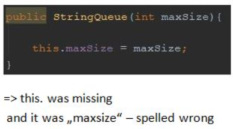 
    
    2. Fehler 2: Wenn elements.size() == 0 ist, soll ein Element gelöscht werden, doch wenn size() 0 ist, dann ist elements leer => elements.size() > 0.
    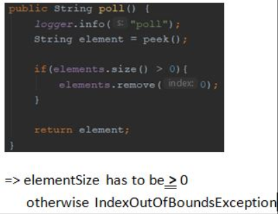 
    
    3. Fehler 3: element wird ein leerer String zugewiesen => element = poll().
    

4. #### Testing
    Um gut zu testen wurde ein setUp erstellt. Dannach wurden insgesamt acht Testmethoden geschrieben um eine line coverage von 100% zu erreichen.
    Alle Methoden wurden mit JavaDoc Kommentare versehen um die Dokumentation durchführen zu können. 
    
    StringQueueTest.java run with Coverage:
    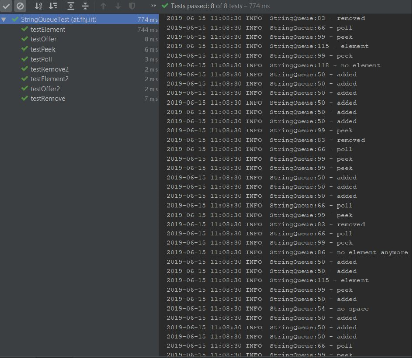
    
    JavaDoc Kommentare:
    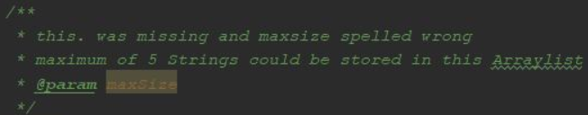
     
    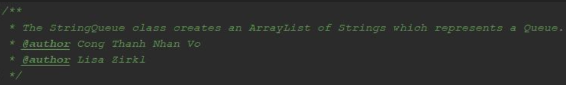
     
    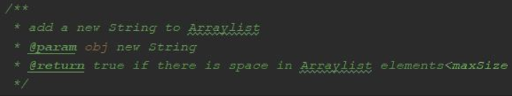 
    
    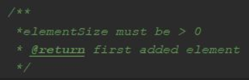
     
    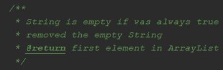 
    
    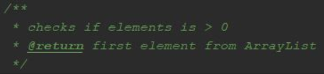 
    
    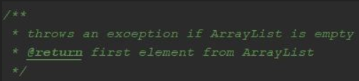

5. #### POM.XML
    Um einen Log auszugeben, wurde log4j mittels Maven dependencies integriert. Danach wurde ein statischer Logger ertellt und in jeder Methode implementiert. Um diesen Logger zu testen, wurde eine Main Methode erstellt und diverse Methoden aufgerufen. 
    
    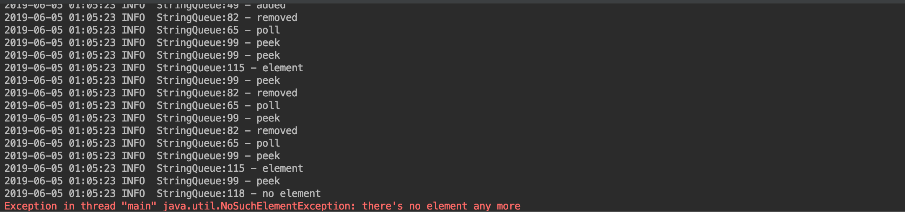

5. #### Maven Site
    Damit man Maven Sites erstellen kann, wird der site-Ordner im src-Ordner angelegt. Darin wurde das site.xml erstellt.
    
    
#### Links:
- https://blog.akquinet.de/2012/04/12/maven-sites-reloaded/
- http://maven.apache.org/plugins/maven-site-plugin/
- https://maven.apache.org/xsd/maven-4.0.0.xsd
- https://www.javatpoint.com/maven-pom-xml

Studenten:

- Christian Vo
- Lisa Zirkl
    

